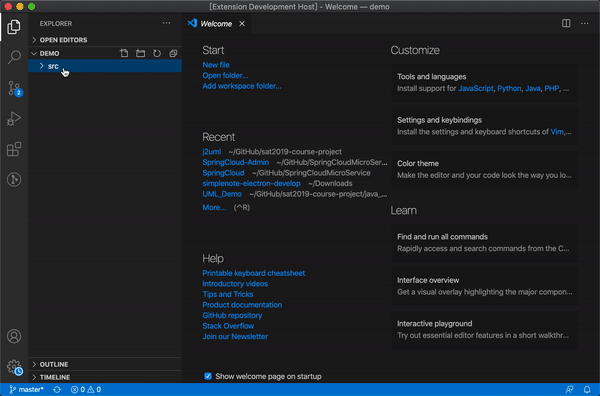

# j2uml README

This is the README for extension "j2uml". 

## Features

"j2uml" can help you transform `*.java` files to UML graph of its class.

## Requirements

Since "j2uml" uses [plantuml](https://plantuml.com/) to generate UML graph, before using "j2uml", you should install `graphviz`:
- Linux: `sudo apt-get install graphviz`
- MacOS: `brew install graphviz`

## How to use

## Release Notes

### 1.0.0

Initial release of "j2uml"

